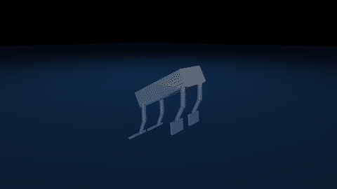
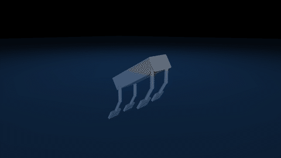

# swimopt

[](https://github.com/lxtuni/swimopt/actions/workflows/tests.yml)

**Work out how a legged robot should swim — automatically.**

You hand it a robot model. It figures out how the robot should move its legs to swim
as fast, as straight, or as efficiently as you ask for, by simulating the paddling and
searching the space of possible strokes.

<table>
<tr>
<td width="50%"></td>
<td width="50%"></td>
</tr>
<tr>
<td><b>Hand-built gait</b><br>0.09 m/s &middot; 0.38 body lengths/s &middot; rocks 27° in pitch</td>
<td><b>After 4000 CMA-ES evaluations</b><br>0.34 m/s &middot; 1.41 body lengths/s &middot; straight and level</td>
</tr>
</table>

Same robot, same water, about five minutes of searching on a 16-core laptop: 3.7 times
faster, while staying inside 10 degrees RMS of heading and roll and 15 of pitch. See
[Status](#status) for how reliable that number is.

A Chinese translation of the user guide is available in [README.zh-CN.md](README.zh-CN.md).

---

## What it actually does

Give it any MuJoCo or URDF robot. It then:

1. **Puts it in water.** A Morison-type hydrodynamic model is attached to every link —
   buoyancy, direction-dependent drag, added mass, viscous damping — with coefficients
   assigned by matching link names against rules in a config file.
2. **Gives every joint a stroke to follow.** Each actuator gets a two-harmonic Fourier
   series with its own amplitude, phase and mean angle, plus a duty-cycle warp so the
   power stroke can be faster than the recovery stroke.
3. **Searches for the best stroke.** CMA-ES varies those parameters, scores each
   candidate by an explicit objective, and keeps the best.

The output is a set of gait parameters you can replay, inspect per joint, or send to
real servos.

**Why bother.** Published paddling-robot studies usually hand-pick two or three gaits —
diagonal, front–back, wave — and compare them. The real space is much larger:
frequency, per-joint amplitude, phase offsets, mean angles, harmonic content and duty
cycle all interact. swimopt searches that space instead of sampling three points in it.

**Swapping robots touches one line.** The physics and control layers never mention a
specific robot, so a new machine means a new model file and a new `"model"` entry, not
a code change. That matters while the CAD is still moving.

Built for the thesis *"Hydrodynamic Modeling and Trajectory Optimization of Paddling
Propulsion for a Quadruped Robot."*

---

## Try it

Requires Python 3.10–3.12.

```bash
git clone https://github.com/lxtuni/swimopt.git
cd swimopt
pip install -r requirements.txt
```

```bash
python view.py     config.json --demo    # watch a hand-built gait swim
python optimize.py config.json 4000      # search for a better one (a few minutes)
python view.py     config.json           # watch what it found
```

On Windows, double-click the numbered launchers instead — `0_setup_env.bat` builds a
local virtualenv, then `1_demo_gait.bat` through `8_control_panel.bat` run the same
steps in order.

Candidates are evaluated in parallel, one worker process per candidate up to your CPU
count; a parallel search returns exactly what a serial one would. Results land in
`results/`: `best.json` holds the full parameter vector, `run_config.json` the exact
configuration and library versions, plus `log.csv` and `convergence.json`.

To check an installation, or any change you make:

```bash
pip install -r requirements-dev.txt
python -m pytest
```

---

## The control panel

`python ui.py`, or double-click `8_control_panel.bat`. Everything above, without the
command line.


The four numbered sections are the whole workflow:

1. **Model** — pick a robot from `robots/`, or import a URDF and have it converted,
   actuated and activated in one click.
2. **Search space** — tick what the optimizer is allowed to vary. Unticking freezes a
   parameter, and the dimension count on the right updates live. Freezing phase and
   offset collapses the 35-dimensional search to 8, which is how you compare a fixed
   gait family (diagonal against front–back against wave) at its own best frequency
   and amplitude.
3. **Run settings** — budget, rollout length, population, seed, and how much of the
   search you want to watch happen.
4. **Objective** — how straight and how level the gait must be, as RMS limits in
   degrees on heading, roll and pitch, plus an optional power weight. Presets cover
   *straight and level*, *strict*, *power-thrifty*, and *no limits* for comparison.

Below them: the best gait so far, one row per actuator, next to the convergence curve
and the CMA-ES step size.

---

## Architecture

```
robots/*.xml     1 model layer       the only thing that changes per robot
hydro.py         2 physics layer     robot-agnostic Morison hydrodynamics (vectorized)
gait.py          3 control layer     robot-agnostic Fourier + duty-cycle gait
simulate.py      --  glue: one rollout gives one score
optimize.py      4 optimization      CMA-ES
optimize_view.py 4 optimization      same, with live rendering
ui.py            Tkinter control panel
import_model.py  URDF to MJCF importer (portable meshes, automatic actuators)
set_model.py     switch the active robot
view.py          replay a gait or the best result
config.json      every parameter, with inline comments
tools/           the drag-versus-lift study, and the images in this README
tests/           pytest suite: physics checks, parallel == serial, importer
```

There is one simulation loop, in `Swimmer.rollout`. The live viewer renders through
its callback rather than keeping a copy, so what you watch is exactly what is scored.

---

## The physics

Per-link quasi-steady Morison-type force, scaled by immersion fraction `f`:

```
F = rho*g*V*f            buoyancy
  + 0.5*rho*Cd*A*v|v|*f  quadratic drag, anisotropic (per-axis Cd)
  + Ca*rho*V*(dv/dt)     added mass
  + cv*v*f               linear viscous
```

- **Partial immersion** comes from each geom's true vertical extent under its current
  orientation, not a bounding sphere, so a flipper rolling at the surface gets the
  right `f`.
- **Anisotropic drag is what produces thrust at all.** The paddle face has a large
  `Cd`, the thin edge a small one, and the difference over a stroke cycle is the net
  force.
- **Added mass** uses the "mass trick": add `m_a = Ca*rho*V` to the body's inertial
  mass and cancel the resulting extra weight with a constant upward force. It is an
  isotropic approximation, but it is numerically unconditionally stable, which the
  explicit `dv/dt` form is not.
- **Not modelled:** turbulence, vortex shedding, wake interaction, free-surface waves.
  These matter for violent manoeuvres; for steady paddling their mean effect is
  absorbed into experimentally calibrated coefficients. Same modelling level as the
  beaver-robot literature this builds on.

### Drag-based and lift-based propulsion

The terms above are all **resistive**: every one is anti-parallel to a component of the
relative flow. A swimmer built only from them can only push water backwards — it
paddles. Real flippers also work as foils, generating force *across* the flow, and that
mechanism needs its own term.

`hydro.lift` adds it. It is **off by default**, so the base model stays purely
resistive unless you ask for lift:

```
Cl(alpha) = cl * sin(2*alpha)      alpha = angle between the flow and the plate's plane
L = 0.5*rho*Cl*A*|v|^2             perpendicular to the flow, in the (flow, normal) plane
```

This is the post-stall flat-plate model, which is the right level of description for a
paddle sweeping through large angles. The plate normal is taken to be the axis with the
largest `Cd`, so no extra geometry description is needed. Each link opts in with a `cl`
in its rule; anything not plate-like keeps `cl: 0`.

Why it changes conclusions: at small angle of attack lift grows like `alpha` while the
resistive terms grow like `alpha^2`. A fast, shallow, feathered sweep therefore
produces almost nothing in the resistive model and a great deal with lift enabled.

> **With `lift: false`, a lift-based gait cannot win a search here, because the
> mechanism that would let it win is not implemented.** A resistive-only result is a
> statement about drag-based paddling, not about optimal swimming in general. Say which
> setting produced any number you report.

Every rollout reports the signed forward impulse from the lift term and from the
resistive terms, so "is this gait lift-based or drag-based" is a measurement rather
than an impression. The split is checked against momentum conservation by the tests.
To run the comparison end to end:

```bash
python tools/compare_lift.py 4000 --seeds 3
```

It is a 2x2: physics (lift off, lift on) against objective (the straight-and-level
limits, or no limits). The objective has to be a factor: lift on a flipper necessarily
puts a moment on the hull, so constraining attitude constrains lift, and measuring at
one setting cannot separate "lift is a worse way to swim" from "lift is being taxed
for tilting the robot". Every cell runs several seeds, so differences between cells can
be read against the spread inside a cell, and every winner is re-scored under the other
physics.

**`cl` is not calibrated.** 1.1 is the textbook flat-plate value. Results from it are
qualitative until the real flipper is measured.

#### What the comparison found

`toy_quad`, 4000 evaluations per run, population 16, three seeds per cell, mean ± sd.
Only the constrained cells describe gaits a robot could use; see below for why the
unconstrained ones are not trustworthy.

| straight and level | speed m/s | stroke Hz | power W | cost of transport J/m |
|---|---|---|---|---|
| drag only | 0.274 ± 0.087 | 1.72 ± 0.16 | 7.0 ± 3.8 | 24 ± 8 |
| drag + lift | 0.220 ± 0.030 | 1.28 ± 0.59 | 3.1 ± 0.7 | 14 ± 2 |

<table>
<tr>
<td width="50%"></td>
<td width="50%"></td>
</tr>
<tr>
<td><b>Lift on, straight and level</b><br>thrust comes from lift; drag is pure loss</td>
<td><b>Drag only, no limits</b><br>fast, rolling, flippers out of the water half the time</td>
</tr>
</table>

What the data supports:

- **With lift in the model, every search chose lift-based propulsion.** In all three
  seeds the lift term supplies +1.4 to +2.0 N*s of forward impulse while the resistive
  terms supply −1.2 to −1.8 N*s: lift does all of the pushing and drag is pure loss.
  The optimizer could have kept paddling and taken lift as a bonus; it never did. In
  the drag-only cells the resistive terms are the net propulsion, as they must be.
- **They are not faster.** The speed gap, 0.054 m/s, is smaller than the spread
  between seeds of the drag-only cell. Nothing here says which is faster.
- **Whether they are more efficient is not settled either.** On average the lift-based
  gaits cost 14 ± 2 J/m against 24 ± 8, but they are also slower, and cost of
  transport rises with speed because drag grows with its square. The one drag-only gait
  at a comparable speed, 0.175 m/s, costs 14.9 J/m, inside the lift-based range of 11.8
  to 16.1. This data cannot separate "lift is more efficient" from "slower is cheaper";
  that needs a comparison at matched speed.
- **Each optimum depends on its physics.** Re-scored with lift on, the drag-only
  winners fall to 0.07 m/s and none stays straight and level. The lift-based winners
  re-scored without lift fall to 0.09 m/s.

What it does not support: the unconstrained cells report 0.76 ± 0.40 m/s for drag and
0.41 ± 0.06 m/s for lift, but those gaits roll 50 to 110 degrees RMS and keep a
flipper above the water 31 to 53 % of the time — they row across the surface. This
model has no free-surface physics, no splash and no wave drag, so those speeds are
outside what it can predict. None of the constrained winners ever lifts a flipper out
of the water. The limits do more than make the robot swim straight: they keep the
search inside the model's range of validity.

So for the claim that the optimal stroke is lift-based: the mechanism holds up — given
the physics to use lift, the optimizer uses it every time, and a paddling gait
optimized without lift falls apart once lift exists. Faster or more efficient is not
shown. The next experiment is cost of transport at matched speed, and a calibrated `cl`
for the real flipper.

Links are matched to coefficients by **name pattern** in `config.json`, so a new robot
needs no code change — just a rule like
`{ "match": "flip", "cd": [2.2, 0.10, 0.10], "ca": 1.0 }`.

---

## The gait parameterization

```
q_i(t) = offset_i + sum_h  A_{i,h} * sin(2*pi*h*f*t + phi_{i,h})       h = 1, 2
```

plus a duty-cycle phase warp that lets the power stroke occupy a different fraction of
the cycle than the recovery stroke.

**What the second harmonic is for.** It is invariant under a phase shift of pi, which
makes it the natural way to express flipper feathering — spread on the power stroke,
furl on recovery — the way a passive flipper does on the real robot.

An earlier version of this README claimed the second harmonic was the prerequisite for
any net thrust: with one harmonic, antiphase legs would push exactly opposite and
cancel. **That is wrong for this model, and was never tested.** The cancellation
argument only holds for strictly reciprocal motion. toy_quad drives three joints per
leg with independent phases, so even one harmonic sweeps the leg non-reciprocally.
Measured, 1600 evaluations each:

| harmonics | duty cycle | speed | straight and level |
|---|---|---|---|
| 1 | fixed at 50 %, a pure sinusoid | 0.156 m/s | roll 10.2°, just over |
| 1 | free, the search chose 26 % | 0.296 m/s | yes |

A fast power stroke with a slow recovery produces thrust on its own, because drag grows
with the square of speed. Whether a second harmonic is *necessary* depends on the leg:
it may well be for a leg with one actuated joint and a passive flipper, which is worth
testing on BODY2 rather than assuming.

Any parameter group can be frozen, from the panel or the config file.

---

## The optimizer

CMA-ES (Hansen & Ostermeier 2001), via the `cma` package. It is a **gradient-free
evolution strategy, not reinforcement learning** — it optimizes the parameters of a
fixed-form trajectory, not a state-feedback policy.

```
fitness = speed in body lengths/s
        - sum over heading, roll, pitch of  max(0, RMS - limit) / limit
        - w_energy * mean power
```

**Straight and level are limits, not weights.** Inside every limit a gait is judged on
speed alone. Each 100 % of excess over a limit costs one body length per second, which
is more than any gait here swims, so an out-of-limit gait cannot buy its way back with
speed. The defaults are 10 degrees RMS heading, 10 roll and 15 pitch; paddling rocks
the body, so pitch is looser. Measuring speed in body lengths keeps the scale the same
for any robot.

An earlier version used additive weights, `speed - w_yaw*yaw_rate - w_attitude*...`.
Weights like that only work at the speed scale they were tuned for. Once the model was
fixed and the legs could really move, speed swamped them and the best gait rolled 42
degrees and veered 44.

The objective is a ruler, not a result. Fitness values are not comparable across
different settings, so report the physical quantities — m/s, body lengths/s, degrees,
watts — never the fitness number.

**Budget.** The gait space has 35 dimensions and is strongly multimodal. At 250
evaluations CMA-ES has barely started; even at 4000 with a population of 16 the best
gait is still improving slowly. Treat any single run as a lower bound, and compare
conditions over several seeds, as `tools/compare_lift.py` does, rather than trusting
one number. Convergence means the fitness curve flattens **and** the step size sigma
shrinks.

---

## What is not in this repository

- The **BODY2 CAD model** (`robots/body2.xml` and its STL meshes) — lab property, and
  gitignored. `robots/toy_quad.xml` is a small open four-legged swimmer that exercises
  every feature and is enough to reproduce everything here.
- Reference papers — copyrighted.
- `mjenv/` — the machine-specific virtualenv.

To use your own robot:

```bash
python import_model.py my_robot.urdf robots/mine.xml --drive "2.1,1.1"
python set_model.py
```

The importer copies meshes locally and rewrites paths, so the model stays portable
across machines.

Note that URDF cannot express closed kinematic loops. A parallelogram or five-bar leg
imports as an open tree and produces no thrust; close it manually with MuJoCo
`<equality><connect>` after import.

---

## Status

Validated end to end on `toy_quad`: `python optimize.py config.json`, 4000 rollouts,
population 16, MuJoCo 3.14, about five minutes on 16 cores.

| | hand-built | optimized, best of 3 seeds |
|---|---|---|
| forward speed | 0.092 m/s | **0.336 m/s** |
| body lengths per second | 0.38 | **1.41** |
| RMS heading / roll / pitch | 3.5 / 1.9 / **26.7** deg | 7.1 / 6.7 / 9.1 deg |
| mean mechanical power | 8.4 W | 9.2 W |
| stroke frequency | 1.2 Hz | 1.73 Hz |

**How reliable is one run?** Not very, yet. Three seeds with identical settings reached
0.175, 0.336 and 0.311 m/s, all inside the limits. The gait space is strongly
multimodal and a single CMA-ES run at this budget can settle in a clearly worse
optimum. Run several seeds and keep the best, or report the spread; any one number is a
lower bound on what the model allows.

Everything is deterministic. The same seed reproduces a run bit for bit, the panel and
the command line reach identical results, and a parallel search returns exactly what a
serial one would; the test suite checks all three.

Coefficients are literature values and `cl` is a textbook flat-plate figure.
Experimental calibration against the physical robot — coast-down, static draft,
pendulum decay, biped paddling — is the next step, and is what the accuracy ultimately
rests on, not the choice of simulator.

### Correction

Numbers published in this README before September 2026 are withdrawn. They came from a
model whose joint limits were read in degrees instead of radians: every leg was pinned
to ±1.3 degrees, and the actuators spent about nine tenths of their power fighting the
limits. The same hand-built gait went from 0.025 to 0.092 m/s once fixed. The drag
versus lift comparison was rerun from scratch on the corrected model, with several
seeds, and the section above replaces the earlier one.

## Regenerating the images

```bash
python tools/render_media.py --sim              # both gait clips, offscreen
python tools/render_media.py --panel --run 4000 --seed 2   # real search, then screenshot
```

The simulation frames render offscreen, so they need no visible window and come out the
same on any machine. The panel screenshot drives a real optimization through the real
window, so it needs a desktop session and `pillow`.

---

## References

- Morison, J.R. et al. (1950). The force exerted by surface waves on piles. *J. Pet. Technol.* 2(5).
- Fossen, T.I. (1994). *Guidance and Control of Ocean Vehicles*. Wiley.
- Chen, G. et al. (2023). Modeling of swimming posture dynamics for a beaver-like robot. *Ocean Engineering*.
- Chen, G. et al. (2021). Hydrodynamic analysis of webbed feet. *Ocean Engineering* 234:109179.
- Hansen, N. & Ostermeier, A. (2001). Completely derandomized self-adaptation in evolution strategies. *Evolutionary Computation* 9(2):159–195.
- Lee, S. et al. (2025). Unified fluid–robot multiphysics simulation and optimization. arXiv:2506.05012. *(workflow reference; they use a gradient method, this project uses CMA-ES because MuJoCo is not differentiable)*

## License

MIT — see [LICENSE](LICENSE).
