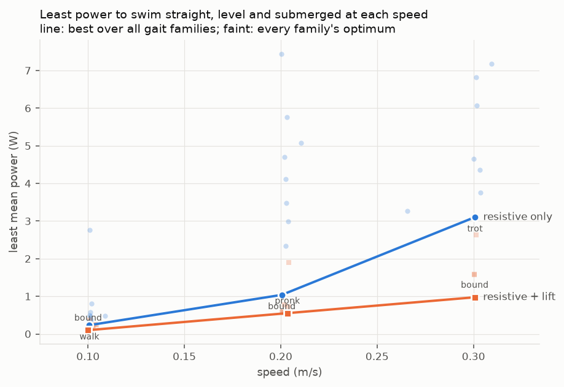
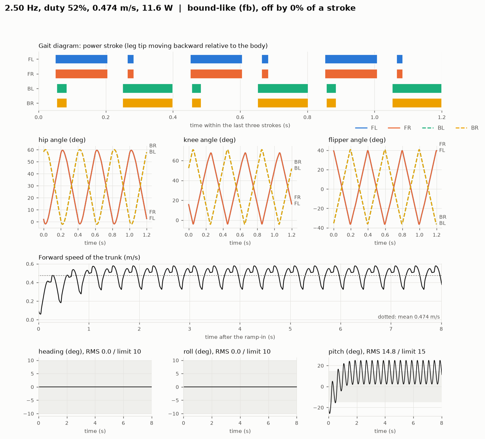

# swimopt — 四足水下机器人 最优泳姿自动寻优管线

**一句话**：把机器人模型当成可替换的输入，用 CMA-ES 在步态参数空间里自动搜出游得最快的泳姿。
换机器人时**只替换 `robots/*.xml`**，其余代码一行不用改。

<table>
<tr>
<td width="50%"></td>
<td width="50%"></td>
</tr>
<tr>
<td><b>手工步态</b><br>0.07 m/s &middot; 0.29 体长/秒 &middot; 俯仰晃动 27°</td>
<td><b>优化后的 bound（跳跃步态），2500 次 CMA-ES 评估</b><br>0.47 m/s &middot; 1.98 体长/秒 &middot; 直行且平稳</td>
</tr>
</table>

同一台机器人、同样的水、同样的 400 度/秒舵机，在 16 核笔记本上搜索约五分钟，快 6.8 倍，
且航向、横滚 RMS 在 10 度以内、俯仰在 15 度以内。三个种子分别为 0.474、0.518、0.450 m/s；
0.518 那个有 10% 的时间肢体露出水面，超出模型有效范围，所以展示的是种子 1。

这个数字依赖于几件事，写论文时应一并说明：划水频率顶在搜索上限 2.5 Hz；舵机全程处于
力矩上限（模型没有发热）；俯仰正好卡在 15 度限值上。详见 [Status](README.md#status)。

> **更正**：2026 年 9 月之前 README 中的数字已撤回。当时的模型把关节限位按角度而非弧度解析，
> 每条腿都被锁在 ±1.3 度，执行器约九成功率花在对抗关节限位上。修正后同一手工步态从
> 0.025 m/s 变为 0.092 m/s。阻力与升力的对照实验已在修正后的模型上用多个种子完全重做。

> **推进机制开关**：`hydro.lift` 默认 **false**，此时模型只有阻力型推进，升力型步态
> 无法胜出，因为让它胜出的机制没有参与计算。设为 **true** 后，带 `cl` 的连杆会获得
> 垂直于来流的升力，用平板后失速模型 `Cl(α) = cl·sin(2α)`。
>
> 每次仿真都会报告升力项和阻力项各自贡献的有符号前向冲量，所以"这是升力型还是
> 阻力型"是可测量的，不靠看动画判断。
>
> **相同速度下的对比**（`python tools/pareto.py 2500 --seeds 2`）：对每种物理、每个目标速度、
> 每个步态族，在满足直行平稳限值、肢体露出水面不超过 5% 的前提下，求达到该速度的**最小平均功率**，
> 取所有步态族中的最小值。400 度/秒舵机，5 个步态族 × 2 个种子 × 每点 2500 次评估：
>
> | 目标速度 | 仅阻力 | 阻力 + 升力 | 升力 / 阻力 |
> |---|---|---|---|
> | 0.10 m/s | 0.23 W（walk） | 0.10 W（bound） | 0.43 |
> | 0.20 m/s | 1.04 W（bound） | 0.55 W（pronk） | 0.53 |
> | 0.30 m/s | 3.10 W（trot） | 0.97 W（bound） | 0.31 |
>
> 
>
> - **只要模型包含升力，搜索保留下来的步态全部是升力型**：22 个合格的升力物理最优解中，
>   升力提供全部前向冲量，阻力项的净冲量全部为负（纯损耗）。优化器有得选时从不划水。
> - **在相同速度下，有升力时所需功率在三个速度上都更低**，约为二到三分之一。这是同速度比较，
>   不能用"更慢所以更省"来解释。
> - **每个最优解都依赖于它的物理**：去掉升力，升力型最优解只剩 35% 到 58% 的速度；
>   阻力型最优解加上升力后没有一个还能直行平稳。
> - **差距的具体大小尚不确定**：搜索未收敛，第二个种子把仅阻力在 0.20 m/s 的最小功率从 2.99 W
>   降到 1.04 W。两条曲线都是真实最小功率的上界。可靠的是方向（三个速度上升力都更低），不是比值。
>
> 所以就"最优泳姿是升力型"这一论文结论而言：**在本模型中成立**——只要有升力可用，优化器就会用它，
> 且在相同速度和姿态约束下所需功率明显更低。它能否在真实脚蹼上成立，取决于实测 `cl`；
> 模型也没有涡脱落、尾流捕获等非定常效应，这些可能使结论向任一方向变化。
> 旧的 `tools/compare_lift.py`（最快步态对比）仍可运行，但其已发表的数字早于舵机模型，已撤回。
>
> 注意 `cl` 尚未标定，1.1 是平板教科书值，结论在实测脚蹼之前只具定性意义。

> 界面与代码均为英文，本文给出对应的中文说明。English README: [README.md](README.md)

---

## 目录结构（四层解耦）

```
swimopt/
├── robots/toy_quad.xml   ① 模型层 —— 唯一会变的东西（换机器人只动这里）
├── hydro.py              ② 物理层 —— 通用水动力(浮力+各向异性阻力+附加质量)
├── gait.py               ③ 控制层 —— 通用步态参数化(双谐波傅里叶)
├── simulate.py           ── 把①②③串起来，跑一次给一个分数
├── optimize.py           ④ 优化层 —— CMA-ES 寻优
├── view.py               ── 可视化：打开窗口看机器人游
├── config.json           ── 所有参数(水动力系数/步态范围/目标函数)
└── results/              ── best.json / log.csv / convergence.json
```

---

## 推荐用法：双击 `8_control_panel.bat`（图形界面，全都装在里面）

一个窗口搞定：选/导入模型 → 勾选要搜的参数 → 设置预算 → 开始寻优（可边跑边看）→ 看收敛曲线和最优参数表。


**面板四块**：
> 面板界面为英文，下面括号里给出对应的英文标签。

1. **Model（模型）**：下拉选 `robots/` 里的模型；`Import URDF…` 一键转换并自动启用
2. **Search space（搜索空间）**：`Gait family` 下拉选步态族（free 自由相位 / trot 对角 / pace 同侧 / bound 前后跳跃 / walk 波形 / pronk 同步）；勾选 `Frequency / Amplitude / Phase / Offset` —— **取消勾选=冻结该参数**，右侧实时显示 `optimizing X / Y dims`
3. **Run settings（运行设置）**：`Evaluations`（评估次数）、`Seconds per rollout`（每次仿真秒数）、`Population size`（种群大小）、`Random seed`（随机种子，必须非零）、`Playback`（可视化模式：every candidate / one in five / new records only / no window）
4. **Objective（目标）**：`Goal` 选最快（speed）或在给定最低速度下最省功率（power）；`Servo no-load speed` 舵机空载转速（度/秒）；航向、横滚、俯仰三项 RMS 的容差（度），以及可选的功率权重。预设有 `Straight + level`、`Strict`、`Power-thrifty` 和用于对照的 `Fastest (no limits)`

下方是**结果区**：左侧表格列出**每个电机的运动规律**（offset / 1 次幅度相位 / 2 次幅度相位），右侧**收敛曲线** + σ 值。

---

## 三个常见疑问

**Q: 参数是随机乱试吗？**
不是。CMA-ES 只有**第一代**在初始点周围撒点；之后每一代都根据上一代哪些参数表现好，**朝好的方向撒下一批**，并自动调整撒布范围（协方差自适应）。所以是"有指导的搜索"。

**Q: 怎么知道搜索够充分了？**
看面板右下两个指标：
- **收敛曲线走平**（红线不再上升）→ 再多试也难提高
- **σ（搜索半径）变小**（比如从 0.25 降到 <0.05）→ 优化器已经聚焦到一小片区域
两个同时满足 = 收敛。想再确认，把"随机种子"改个数字重跑一次，若结果接近 → 找到的是**稳定的最优**，不是运气。

**Q: 只想让它以特定步态运动？**
在 `Gait family` 里选一个步态族：各腿的时序固定，其余（频率、占空比、幅度、偏置、每类关节的相位）照常搜索，
维度从 35 降到 **17**，搜索可靠得多。这正是做**步态对比实验**的正确姿势：每个步态族在各自最好的划法下比较，
`python tools/gait_families.py 2500 --seeds 3` 一次跑完（结果见下文"步态族对比"）。

---

## 也可以双击单个 .bat（不用图形界面）

| 双击这个 | 作用 |
|---|---|
| `0_setup_env.bat` | 装 Python 环境和 MuJoCo（**第一次只需运行一次**） |
| `1_demo_gait.bat` | 打开 3D 窗口，看机器人用手工步态游 |
| `2_optimize.bat` | CMA-ES 自动搜最优泳姿（预算取自 config.json，并行评估，结果存 results/） |
| `3_view_best.bat` | 打开窗口，看搜出来的最优泳姿 |
| `4_import_model.bat` | 把你的 URDF 转成本管线可用的模型 |
| `5_optimize_live.bat` | **边寻优边看**：每试一组参数就播放一次，跑完自动换下一组 |
| `6_optimize_live_best_only.bat` | 同上，但只回放"刷新纪录"的那几次（省时间，看得清进步） |

**看训练过程的三种模式**（`optimize_view.py`）：

```bat
python optimize_view.py config.json 1000              REM 每组都看(快进播放)
python optimize_view.py config.json 1000 --every 5    REM 每5组看1组, 其余后台快跑
python optimize_view.py config.json 1000 --best       REM 只回放刷新纪录的那几次
python optimize_view.py config.json 1000 --rt         REM 实时速度(慢, 但看得最清楚)
```
> 关掉窗口 = 提前结束并保存当前最优；控制台每次都会打印速度/偏航/fitness，刷新纪录时标 * NEW BEST

> ⚠️ **不要直接双击 .py 文件**——出错时窗口会瞬间关闭，什么也看不到。
> .bat 会在结束/出错时停住并显示原因（按任意键才关）。

---

## 手动安装（一次）

在仓库目录里执行：

```bat
python -m venv mjenv
mjenv\Scripts\activate
pip install -r requirements.txt
```

检查安装是否正常（可选）：

```bat
pip install -r requirements-dev.txt
python -m pytest
```

## 三个命令

```bat
REM 1) 先看一眼：打开窗口，播放手工示例步态
python view.py config.json --demo

REM 2) 自动寻优：CMA-ES 搜最优泳姿（预算取自 config.json，默认 4000 次，并行几分钟）
python optimize.py config.json

REM 3) 看优化结果：播放搜出来的最优步态
python view.py config.json results/best.json
```

**窗口操作**：左键拖=转视角，右键拖=平移，滚轮=缩放，空格=暂停，Esc=退出。

---

## 载入你自己的模型（环境不用重装！）

环境装过一次就不用再装。载入新模型只要 3 步：

**① 转换模型**：双击 `4_import_model.bat` → 把你的 `.urdf` 拖进窗口 → 回车
   脚本会自动：修复 `package://` 网格路径、加关节阻尼/armature（稳定性）、
   **给根连杆加自由关节**（URDF 没有浮动底座，不加的话机器人焊死在世界上，根本游不动）、
   **把与碰撞体重复的视觉几何体标成 `vis_`**（否则浮力、阻力、附加质量全部翻倍）、
   为驱动关节加执行器并把控制范围限制在关节自身范围内、按刚体名给几何体命名、输出报告。
   结果存到 `robots/你的名字.xml`。

   也可以用命令行（能自定义参数）：
   ```bat
   python import_model.py 路径\你的.urdf robots/mymodel.xml --drive "2.1,1.1" --armature 3e-4 --kp 15 --force 3
   ```
   | 参数 | 作用 |
   |---|---|
   | `--drive` | 关节名含哪些关键字的加执行器（逗号分隔）。不写=所有可动关节都加 |
   | `--armature` | 关节等效转子惯量。**小连杆链发散时调大**（1e-4 ~ 1e-3） |
   | `--damping` | 关节阻尼 |
   | `--kp` / `--force` | 执行器刚度 / 最大力矩。**发散就调小** |

**② 改 config**：打开 `config.json`，把 `"model"` 改成新模型路径，
   `"trunk_body"` 改成机身刚体名（导入报告里能看到），
   `hydro.rules` 的 `match` 关键字改成你模型里的命名（报告会列出匹配情况）。

**③ 跑**：双击 `1_demo_gait.bat` 先看动起来了没，再 `2_optimize.bat`。

> ⚠️ **本机若有旧版导入工具生成的 `robots/body2.xml`，请重新导入。** 旧工具有两个缺陷：
> 不加自由关节（机器人焊死在世界上），且视觉与碰撞几何体都参与水动力计算（所有流体力翻倍）。
> 现在的水动力模块会自动跳过重复的视觉几何体，并在启动信息里提示缺失的自由关节，
> 但重新导入才是根本解决办法。
>
> 旧说明：已经帮你转好一份 `robots/body2.xml`（用的是旧版 BODY2 URDF），配置见 `config_body2.json`。
> ⚠️ 注意：旧 URDF 是**开环树**（平行四边形没闭合、坐标系没归零），能跑但产生不了推力。
> 等新模型（销轴都是 revolute）到位后重新导入，再用 `<equality><connect>` 闭合即可。

---

## 换成你的真机器人（原理说明）

1. **放模型**：把 URDF/MJCF 放进 `robots/`，改 `config.json` 里的 `"model"` 路径。
   （MuJoCo 可直接读 URDF；闭环用 `<equality><connect>` 在销轴处闭合。）
2. **命名规范**（决定水动力系数怎么分配）：
   - geom 名字含 `flip` → 用桨的系数（法向大阻力）
   - 含 `link` → 细杆系数
   - 含 `trunk` → 机身系数
   - 纯装饰的 geom 名字加 `vis_` 前缀 → 自动排除
   > 名字规则在 `config.json` 的 `hydro.rules` 里，可随意增改。
3. **可选**：在 `gait.groups` 里把同类关节的幅度绑定，降低搜索维度。

**参数维度会自动适配**：执行器多了少了，参数向量自动变长变短，优化器照跑。

---

## 步态族对比（阻力型物理，400 度/秒舵机，直行平稳限值，3 个种子均值 ± 标准差）

| 步态族 | 速度 m/s | 频率 Hz | 功率 W | 运输代价 J/m |
|---|---|---|---|---|
| **bound（前后跳跃）** | **0.481 ± 0.034** | 2.49 | 12.8 | 27 |
| pace（同侧） | 0.345 ± 0.064 | 2.26 | 10.5 | 32 |
| trot（对角） | 0.344 ± 0.048 | 1.82 | 11.5 | 34 |
| walk（波形） | 0.344 ± 0.098 | 2.00 | 12.0 | 38 |
| pronk（同步） | 0.265 ± 0.038 | 2.48 | 12.0 | 46 |
| 自由相位 | 0.096 ± 0.046 | 0.86 | 1.6 | 15 |

- **bound 胜出，且差距大于种子间离散。** 它左右对称，航向和横滚天然为零，全部自由度都用于推进；
  代价是俯仰，三个 bound 解都卡在 15 度限值上。
- **自由相位的搜索输给了所有步态族。** 它能表达所有步态族，找到的解也分别接近 bound、pronk、trot，
  但 2500 次评估内没找到它们的好版本。这是搜索失败，不是关于协调方式的结论；因此做研究时默认用步态族搜索。
- pronk 种子 1 和 trot 种子 3 分别有 17% 和 49% 的时间肢体露出水面，超出模型范围；可用 `limits.surfacing` 排除。

`python tools/describe_gait.py results/best.json` 会给出一个结果属于哪种步态、偏离多少，并画出步态图
（每条腿何时处于发力冲程，按腿尖相对机身向后运动来定义）、各关节角、速度和姿态：



---

## 关键设计（论文里可以写的点）

- **水动力模型**：Morison 型逐连杆力
  `F = ρgV·f + ½ρ·C_d·A·v|v|·f + c_v·v·f`，`f` = 部分浸没比例（按几何真实竖直跨度算，含姿态）。
  附加质量用"质量戏法"（`m_a = C_a·ρ·V` 加进刚体 + 恒力补偿重力），数值绝对稳定。
- **二次谐波的作用**：它在相位平移 π 下不变，正好用来表达真机被动脚蹼的"整流"顺桨
  （发力时张开、回程时收拢）。
  **更正**：旧版此处断言"只用 1 倍频时反相腿推力精确抵消、净推力恒为 0，已数值验证"。
  **这对本模型不成立，且此前从未验证过。** 抵消论证只适用于严格往复的运动；toy_quad 每条腿有
  三个独立相位的关节，单谐波下腿部已是非往复运动。实测（各 1600 次评估）：单谐波、占空比固定
  50%（纯正弦）仍有 0.156 m/s；单谐波、占空比自由（搜索选了 26%）达到 0.296 m/s 且直行平稳。
  快划慢收本身就能在二次阻力下产生净推力。对于只有一个主动关节、脚蹼被动的腿（如 BODY2），
  二次谐波是否必需，应当实测而不是假定。
- **目标函数**：`fitness = 体长/秒 − Σ max(0, RMS − 限值)/限值 − w_energy·功率`
  对航向、横滚、俯仰三项的 RMS 分别设限值（默认 10、10、15 度）。在限值内只比速度，
  超出部分每超 100% 扣 1 个体长每秒，比任何步态能游的都多，所以超限步态无法靠速度翻盘。
  速度沿初始朝向投影，打转会被自动惩罚。旧版用加法权重 `w_yaw`、`w_attitude`，
  权重只在调参时的速度量级下有效；模型修好、腿真正能摆动后，速度项压倒了惩罚，
  最优步态横滚 42 度、偏航 44 度。
- **测量窗口**：按整数个划水周期计时，避免在一次划水中途截断带来的速度偏差；起步的渐入段（`ramp_t`）仿真但不计分。
- **舵机模型**：直流电机的力矩-转速曲线，静止时为堵转力矩，到空载转速 `servo.max_speed_dps` 时降为零。
  反电动势项等价于粘性阻尼，加进关节阻尼里由 MuJoCo 隐式积分，结果与步长无关。没有转速限制时，
  旧的最优步态需要 2700 到 4200 度/秒，放到 400 度/秒的舵机上根本不前进。
- **有效性指标**：每次仿真报告关节峰值转速、舵机处于力矩上限的时间比例、肢体露出水面的时间比例。
- **两种目标**：`objective.mode` 为 `speed` 时求最快；为 `power` 时在速度不低于 `min_speed` 的前提下求最小平均功率。
  两者都先满足限值，任何超限步态的得分都低于所有合格步态。
- **优化器**：CMA-ES（Hansen & Ostermeier 2001），无梯度，因 MuJoCo 标准版不可微。
  工作流参照 Lee et al. 2025（他们用可微仿真+L-BFGS，我们换成无梯度）。
- **防爆护栏**：速度超阈值或出现 NaN → 立即判负分并中止，优化器自动学会避开奇异区。
- **复位确定性**：`mj_resetData` 瞬时且完全一致，同参数重复跑结果相同（Webots 的世界重载问题不存在）。

---

## 调参速查（`config.json`）

| 想改什么 | 改哪里 |
|---|---|
| 水动力系数（标定后填这里） | `hydro.rules[].cd / .ca / .cv` |
| 水面高度 | `hydro.water_z` |
| 频率/幅度搜索范围 | `gait.freq_range / amp_range` |
| 谐波数（1=纯正弦，2=可整流顺桨） | `gait.harmonics` |
| 目标：直行、平稳的容差 / 兼顾省电 | `limits.heading_deg / roll_deg / pitch_deg`, `w_energy` |
| 肢体露出水面的时间上限 | `limits.surfacing`（如 0.05；null=只报告不约束） |
| 最快 / 给定速度下最省功率 | `objective.mode`, `objective.min_speed` |
| 舵机空载转速 | `servo.max_speed_dps`（null=不限） |
| 步态族 | `gait.family`（null=自由相位，或 trot / pace / bound / walk / pronk） |
| 并行进程数 | `workers`（默认 `"auto"`，结果与串行完全一致） |
| 搜索预算、种群大小 | `budget`, `popsize` |
| 每次仿真时长 | `sim_time` |
