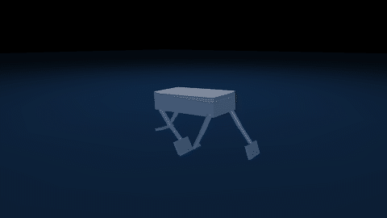
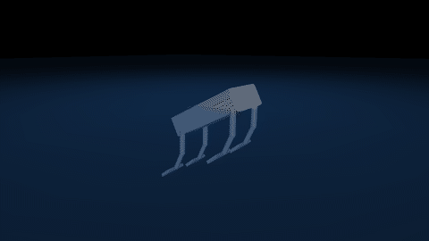
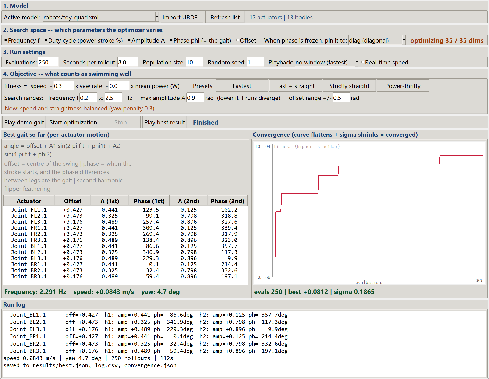

# swimopt — 四足水下机器人 最优泳姿自动寻优管线

**一句话**：把机器人模型当成可替换的输入，用 CMA-ES 在步态参数空间里自动搜出游得最快的泳姿。
换机器人时**只替换 `robots/*.xml`**，其余代码一行不用改。

<table>
<tr>
<td width="50%"></td>
<td width="50%"></td>
</tr>
<tr>
<td><b>手工步态</b><br>0.025 m/s &middot; 0.11 体长/秒</td>
<td><b>250 次 CMA-ES 评估之后</b><br>0.084 m/s &middot; 0.37 体长/秒</td>
</tr>
</table>

同一台机器人、同样的水、三分钟搜索。右边快 3.4 倍，同时横滚剧烈 —— 这不是渲染问题，
而是目标函数的真实盲区，详见 [Status](README.md#status)。

> 界面与代码均为英文，本文给出对应的中文说明。English README: [README.md](README.md)

---

## 目录结构（四层解耦）

```
swimopt/
├── robots/toy_quad.xml   ① 模型层 —— 唯一会变的东西（换机器人只动这里）
├── hydro.py              ② 物理层 —— 通用水动力(浮力+各向异性阻力+附加质量)
├── gait.py               ③ 控制层 —— 通用步态参数化(双谐波傅里叶)
├── simulate.py           ── 把①②③串起来，跑一次给一个分数
├── optimize.py           ④ 优化层 —— CMA-ES 寻优
├── view.py               ── 可视化：打开窗口看机器人游
├── config.json           ── 所有参数(水动力系数/步态范围/目标函数)
└── results/              ── best.json / log.csv / convergence.json
```

---

## 推荐用法：双击 `8_control_panel.bat`（图形界面，全都装在里面）

一个窗口搞定：选/导入模型 → 勾选要搜的参数 → 设置预算 → 开始寻优（可边跑边看）→ 看收敛曲线和最优参数表。



**面板四块**：
> 面板界面为英文，下面括号里给出对应的英文标签。

1. **Model（模型）**：下拉选 `robots/` 里的模型；`Import URDF…` 一键转换并自动启用
2. **Search space（搜索空间）**：勾选 `Frequency / Amplitude / Phase / Offset` —— **取消勾选=冻结该参数**，右侧实时显示 `optimizing X / Y dims`
   - 想固定步态只搜频率和幅度？→ **取消 `Phase` 和 `Offset`**，在下拉里选 `diag / fb / lr / wave / inphase`
3. **Run settings（运行设置）**：`Evaluations`（评估次数）、`Seconds per rollout`（每次仿真秒数）、`Population size`（种群大小）、`Random seed`（随机种子）、`Playback`（可视化模式：every candidate / one in five / new records only / no window）
4. **结果**：左侧表格列出**每个电机的运动规律**（offset / 1 次幅度相位 / 2 次幅度相位），右侧**收敛曲线** + σ 值

---

## 三个常见疑问

**Q: 参数是随机乱试吗？**
不是。CMA-ES 只有**第一代**在初始点周围撒点；之后每一代都根据上一代哪些参数表现好，**朝好的方向撒下一批**，并自动调整撒布范围（协方差自适应）。所以是"有指导的搜索"。

**Q: 怎么知道搜索够充分了？**
看面板右下两个指标：
- **收敛曲线走平**（红线不再上升）→ 再多试也难提高
- **σ（搜索半径）变小**（比如从 0.25 降到 <0.05）→ 优化器已经聚焦到一小片区域
两个同时满足 = 收敛。想再确认，把"随机种子"改个数字重跑一次，若结果接近 → 找到的是**稳定的最优**，不是运气。

**Q: 只想让它以特定姿态运动，只搜频率和幅度？**
面板里**取消勾选 `Phase` 和 `Offset`**，选好固定步态即可 —— 维度会从 34 维降到 **7 维**，搜索快得多，结果也更好解释（"在对角步态下，最优频率是 X、幅度是 Y"）。这正是做**步态对比实验**的正确姿势：固定步态族分别优化，再比谁快。

---

## 也可以双击单个 .bat（不用图形界面）

| 双击这个 | 作用 |
|---|---|
| `0_setup_env.bat` | 装 Python 环境和 MuJoCo（**第一次只需运行一次**） |
| `1_demo_gait.bat` | 打开 3D 窗口，看机器人用手工步态游 |
| `2_optimize.bat` | CMA-ES 自动搜最优泳姿（约 3 分钟，结果存 results/） |
| `3_view_best.bat` | 打开窗口，看搜出来的最优泳姿 |
| `4_import_model.bat` | 把你的 URDF 转成本管线可用的模型 |
| `5_optimize_live.bat` | **边寻优边看**：每试一组参数就播放一次，跑完自动换下一组 |
| `6_optimize_live_best_only.bat` | 同上，但只回放"刷新纪录"的那几次（省时间，看得清进步） |

**看训练过程的三种模式**（`optimize_view.py`）：

```bat
python optimize_view.py config.json 250              REM 每组都看(快进播放)
python optimize_view.py config.json 250 --every 5    REM 每5组看1组, 其余后台快跑
python optimize_view.py config.json 250 --best       REM 只回放刷新纪录的那几次
python optimize_view.py config.json 250 --rt         REM 实时速度(慢, 但看得最清楚)
```
> 关掉窗口 = 提前结束并保存当前最优；控制台每次都会打印速度/偏航/fitness，刷新纪录时标 ★

> ⚠️ **不要直接双击 .py 文件**——出错时窗口会瞬间关闭，什么也看不到。
> .bat 会在结束/出错时停住并显示原因（按任意键才关）。

---

## 手动安装（一次）

```bat
cd C:\Users\L\Desktop\SA
python -m venv mjenv
mjenv\Scripts\activate
pip install mujoco cma numpy
```

## 三个命令

```bat
cd C:\Users\L\Desktop\SA\swimopt

REM 1) 先看一眼：打开窗口，播放手工示例步态
python view.py config.json --demo

REM 2) 自动寻优：CMA-ES 搜最优泳姿（约200次仿真，几分钟；结果存 results/）
python optimize.py config.json 200

REM 3) 看优化结果：播放搜出来的最优步态
python view.py config.json results/best.json
```

**窗口操作**：左键拖=转视角，右键拖=平移，滚轮=缩放，空格=暂停，Esc=退出。

---

## 载入你自己的模型（环境不用重装！）

环境装过一次就不用再装。载入新模型只要 3 步：

**① 转换模型**：双击 `4_import_model.bat` → 把你的 `.urdf` 拖进窗口 → 回车
   脚本会自动：修复 `package://` 网格路径、加关节阻尼/armature（稳定性）、
   为驱动关节加执行器、按刚体名给几何体命名、输出报告。
   结果存到 `robots/你的名字.xml`。

   也可以用命令行（能自定义参数）：
   ```bat
   python import_model.py 路径\你的.urdf robots/mymodel.xml --drive "2.1,1.1" --armature 3e-4 --kp 15 --force 3
   ```
   | 参数 | 作用 |
   |---|---|
   | `--drive` | 关节名含哪些关键字的加执行器（逗号分隔）。不写=所有可动关节都加 |
   | `--armature` | 关节等效转子惯量。**小连杆链发散时调大**（1e-4 ~ 1e-3） |
   | `--damping` | 关节阻尼 |
   | `--kp` / `--force` | 执行器刚度 / 最大力矩。**发散就调小** |

**② 改 config**：打开 `config.json`，把 `"model"` 改成新模型路径，
   `"trunk_body"` 改成机身刚体名（导入报告里能看到），
   `hydro.rules` 的 `match` 关键字改成你模型里的命名（报告会列出匹配情况）。

**③ 跑**：双击 `1_demo_gait.bat` 先看动起来了没，再 `2_optimize.bat`。

> 已经帮你转好一份：`robots/body2.xml`（用的是旧版 BODY2 URDF），配置见 `config_body2.json`。
> ⚠️ 注意：旧 URDF 是**开环树**（平行四边形没闭合、坐标系没归零），能跑但产生不了推力。
> 等新模型（销轴都是 revolute）到位后重新导入，再用 `<equality><connect>` 闭合即可。

---

## 换成你的真机器人（原理说明）

1. **放模型**：把 URDF/MJCF 放进 `robots/`，改 `config.json` 里的 `"model"` 路径。
   （MuJoCo 可直接读 URDF；闭环用 `<equality><connect>` 在销轴处闭合。）
2. **命名规范**（决定水动力系数怎么分配）：
   - geom 名字含 `flip` → 用桨的系数（法向大阻力）
   - 含 `link` → 细杆系数
   - 含 `trunk` → 机身系数
   - 纯装饰的 geom 名字加 `vis_` 前缀 → 自动排除
   > 名字规则在 `config.json` 的 `hydro.rules` 里，可随意增改。
3. **可选**：在 `gait.groups` 里把同类关节的幅度绑定，降低搜索维度。

**参数维度会自动适配**：执行器多了少了，参数向量自动变长变短，优化器照跑。

---

## 关键设计（论文里可以写的点）

- **水动力模型**：Morison 型逐连杆力
  `F = ρgV·f + ½ρ·C_d·A·v|v|·f + c_v·v·f`，`f` = 部分浸没比例（按几何真实竖直跨度算，含姿态）。
  附加质量用"质量戏法"（`m_a = C_a·ρ·V` 加进刚体 + 恒力补偿重力），数值绝对稳定。
- **为什么必须双谐波**：脚蹼若只用 1 倍频正弦，反相腿的推力精确反号 → 四腿抵消，净推力恒为 0（已数值验证）。
  二次谐波在相位平移 π 下不变，正好对应真机被动脚蹼的"整流"顺桨 —— 这是产生净推力的数学前提。
- **目标函数**：`fitness = 沿初始朝向的净位移速度 − w_yaw·偏航率 − w_energy·能耗`
  用"沿初始朝向投影"而非总路程，打转会被自动惩罚。
- **优化器**：CMA-ES（Hansen & Ostermeier 2001），无梯度，因 MuJoCo 标准版不可微。
  工作流参照 Lee et al. 2025（他们用可微仿真+L-BFGS，我们换成无梯度）。
- **防爆护栏**：速度超阈值或出现 NaN → 立即判负分并中止，优化器自动学会避开奇异区。
- **复位确定性**：`mj_resetData` 瞬时且完全一致，同参数重复跑结果相同（Webots 的世界重载问题不存在）。

---

## 调参速查（`config.json`）

| 想改什么 | 改哪里 |
|---|---|
| 水动力系数（标定后填这里） | `hydro.rules[].cd / .ca / .cv` |
| 水面高度 | `hydro.water_z` |
| 频率/幅度搜索范围 | `gait.freq_range / amp_range` |
| 谐波数（1=纯正弦，2=可整流顺桨） | `gait.harmonics` |
| 目标：只看速度 / 兼顾省电 | `w_yaw`, `w_energy` |
| 搜索预算、种群大小 | `budget`, `popsize` |
| 每次仿真时长 | `sim_time` |
